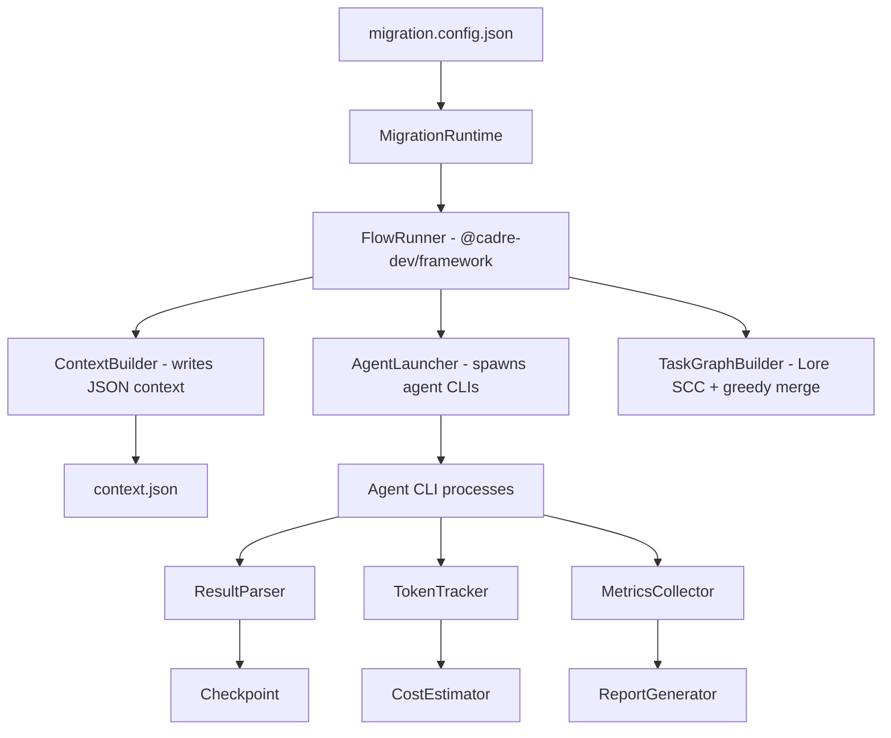

<h1 align="center">AAMF</h1>

<p align="center"><strong>Autonomous Agent Migration Framework</strong></p>

<p align="center">
     <a href="https://github.com/jafreck/AAMF/actions/workflows/ci.yml"></a>
     
     
     <a href="docs/configuration.md#coverage"></a>
     <a href="LICENSE"></a>
</p>

AAMF is a TypeScript runtime for migrating extremely large legacy codebases between languages and frameworks. It uses `@cadre-dev/framework` as the orchestration layer that coordinates the migration flow while AAMF supplies the migration-specific machinery: code indexing, task-graph construction, agent launching, checkpointing, budgeting, observability, and failure adjudication.

The runtime does not perform reasoning itself. Instead, it declares the migration as a deterministic multi-phase flow, launches purpose-built agents out of process, feeds them tightly scoped context, collects structured output, and decides what runs next.

Typical use cases include porting a 100k+ line Python monolith to TypeScript, a COBOL system to Go, or a C library to Rust.

## Repository Layout

- `src/core/`: runtime bootstrapping, agent launching, checkpointing, scaffold generation, and process coordination.
- `src/flow/`: the Cadre flow definition, checkpoint adapters, and phase step implementations.
- `src/agents/`: agent registry, output schemas, prompt generation, and context construction.
- `src/execution/`: dependency-aware task scheduling, retry handling, and parallel execution helpers.
- `src/observability/` and `src/budget/`: token tracking, cost estimation, metrics, and reporting.
- `tests/`: unit, integration, and end-to-end coverage mirroring the runtime structure.
- `agents/templates/`: Markdown templates for each agent role.
- `docs/`: configuration and supporting documentation.


## Projects Ported Using AAMF

| Project | Source | Target | Model | Repository |
|---------|--------|--------|-------|------------|
| lz4 compression library | C | Rust | claude-sonnet-4.6 | [jafreck/lz4r](https://github.com/jafreck/lz4r) |

---

## How It Works

AAMF treats migration as a deterministic pipeline of **9 phases** (0-8). The flow itself is defined with Cadre's flow DSL, and each phase either runs deterministic runtime logic or launches purpose-built agents defined as `.agent.md` prompt files.

Cadre is the orchestration framework that coordinates migration execution. In AAMF, it is responsible for:

- expressing phase ordering, gates, loops, parallel branches, and nested subflows;
- driving resumable execution through checkpoint adapters that persist flow state into AAMF's checkpoint format; and
- enforcing concurrency and execution boundaries while AAMF provides the migration-specific step implementations.




### Cadre-Orchestrated Runtime

At runtime, `MigrationRuntime` constructs a `MigrationFlowContext`, wires AAMF's checkpoint manager into Cadre via `AamfFlowCheckpointAdapter`, and executes the top-level `migrationFlow` with `FlowRunner`.

That flow uses Cadre primitives to model the migration lifecycle:

- `step` for deterministic runtime work and agent launches;
- `gate` for budget enforcement between phases;
- `parallel` for concurrent finalization work such as E2E and documentation;
- `loop` for final-parity and idiomatic-refactor convergence; and
- `subflow` for Phase 4, where per-task and wave-barrier execution are built dynamically from the migration plan.

### From Lore Graph To Executable Tasks

The core planning strategy in AAMF is that migration work is derived from Lore's indexed symbol graph before any code-writing agent starts modifying the target.

Phase 0 uses `@jafreck/lore` to index the source tree into a SQLite knowledge base containing files, symbols, resolved call edges, and type-reference edges. Phase 1 then turns that indexed graph into a deterministic task graph:

1. load symbol and dependency edges from Lore;
2. contract strongly connected components so mutually dependent symbols stay in the same migration unit;
3. greedily merge neighboring clusters by edge weight, but stop whenever a merge would exceed `maxLinesPerTask`;
4. split oversized cyclic regions into stubs plus sequential implementation chunks when needed; and
5. emit `MigrationTask[]` plus explicit dependency edges, SCC metadata, and compilation-unit annotations.

That gives AAMF bounded tasks with intentionally limited scope. Each task is small enough to fit inside an agent context budget, but large enough to preserve the dependency structure needed for a coherent migration.

Determinism matters here. Because the graph is derived from Lore rather than ad hoc planner output, the same indexed codebase produces the same dependency-ordered task inventory, which makes retries, resume, and partial reruns predictable.

### Progressive Ordering And Buildable Checkpoints

Task derivation is only half the problem. The runtime also has to order execution so the target repository can keep moving through states that are actually buildable.

In `per-task` mode, AAMF topologically sorts the Lore-derived task graph, then adds extra ordering edges whenever two tasks would write the same target file. Each task runs through a controlled sequence such as migrate, commit, target re-index, parity verification, and optional format/build/test gates before it is marked complete. That prevents later tasks from racing ahead of prerequisite work or trampling the same output files.

In `wave-barrier` mode, AAMF groups the topological frontier into waves. Tasks inside a wave can run in parallel when they do not overlap on target files, but the runtime inserts a barrier between waves. At that barrier it runs shared validation, including build and test commands, and if validation fails it executes targeted recovery loops until the wave converges or hits the configured limit. Only after the wave passes does AAMF release the next wave.

The practical effect is that AAMF does not just generate tasks in dependency order. It generates tasks in a form that can be executed progressively, with explicit ordering and validation points that preserve usable repository states throughout the migration.

### The Pipeline Phases

| Phase | Name | Agents | Optional | Critical |
|-------|------|--------|----------|----------|
| 0 | **KB Indexing** | *(runtime logic - Lore)* | No | Yes |
| 1 | **Task Graph Construction** | *(runtime logic - Lore)* | No | Yes |
| 2 | **Knowledge Base Construction** | `knowledge-builder` | No | Yes |
| 3 | **Migration Planning** | `migration-planner`, `adjudicator` | No | Yes |
| 4 | **Iterative Migration** | `code-migrator`, `parity-verifier`, `test-writer`, `parity-failure-resolver` | No | Yes |
| 5 | **Final Parity Verification** | `final-parity-checker` | No | Yes |
| 6 | **E2E Testing & Documentation** | `e2e-test-crafter`, `documentation-writer` | No | Yes |
| 7 | **Idiomatic Refactor** | `idiomatic-reviewer`, `idiomatic-refactorer` | Yes | Yes |
| 8 | **Completion** | *(none - summary only)* | No | Yes |

> Phase 7 requires `options.idiomaticRefactor.enabled`. Execution order is 0→1→2→3→4→5→6→7→8. All phases are critical; failure in any phase halts the flow.

---

### Agent Runtime Support

AAMF supports two agent runtimes, selected by `agentRuntime` in the config:

| Runtime | CLI Command | Agent Directory | MCP Config Flag |
|---------|-------------|-----------------|-----------------|
| **Copilot** (default) | `copilot --agent <name>` | `.github/agents/` | `--additional-mcp-config` |
| **Claude Code** | `claude --agent <name>` | `.claude/agents/` | `--mcp-config` |

Both runtimes follow the same lifecycle. `AgentLauncher` delegates backend-specific process handling to the Cadre runtime layer while preserving AAMF-specific output parsing, token tracking, and artifact management.

### Invocation Lifecycle

```
1. ContextBuilder writes a minimal JSON context file
     └─ Contains file paths (not contents), config, phase/task metadata
     └─ Phase 3 context includes ExecutionStrategy for planner awareness

2. AgentLauncher spawns the agent
     └─ <cli> --agent <name> -p <prompt> [--model <model>]
     └─ MCP config injected for KB server access when available
     └─ VS Code environment variables stripped from child process

3. Environment variables are injected:
     AAMF_PROGRESS_DIR   → .aamf/migration/{projectName}
     AAMF_CONTEXT_FILE   → path to the context JSON
     AAMF_PHASE          → current phase number
     AAMF_TASK_ID        → task identifier (Phase 4)

4. The agent reads its context, performs reasoning, writes output files
     └─ stdout/stderr streamed live to .live.log files
     └─ 30s heartbeat logs agent activity
     └─ 10s output directory polling detects new files

5. AgentLauncher collects:
     ├─ Exit code (0 = success)
     ├─ stdout/stderr → log file
     ├─ Output files detected in the progress directory
     ├─ Token usage parsed from output (including cached tokens and premium requests)
     └─ Timing metrics (spawn-to-first-output, queue delay)

6. ResultParser structures the output for the next phase
     └─ Metrics recorded to JSONL observability log
```

### Context Window Management

Context saturation is the primary constraint when migrating large codebases. AAMF minimizes context usage through several mechanisms:

- **File paths, not contents.** Context files contain paths to source files, not their full text. Agents read only what they need.
- **Per-agent scoping.** Each agent type receives a tailored context with only the inputs relevant to its task. The impact assessor sees the source tree, and the code migrator sees one task's files plus its knowledge-base entry.
- **Single-purpose agents.** Each of the 16 agent types has a narrow responsibility, keeping its system prompt focused and its working set small.

### Knowledge Base Access via MCP

When Phase 0 (KB Indexing) is enabled, the runtime builds a SQLite knowledge-base index from source code using `@jafreck/lore`. After indexing, it starts an in-process HTTP MCP server (`KbServerProcess`) on a random local port. The MCP server exposes the knowledge base for agent queries via the Model Context Protocol.

Agent invocations receive the server's URL through MCP config injection, giving every agent efficient access to the indexed codebase (file content, symbols, dependencies, and optional semantic/embedding search) without saturating its context window.

---

## Agent Catalog

AAMF defines 16 specialized agent roles. Each corresponds to a `.agent.md` file in the configured agent directory (`.github/agents/` for Copilot, `.claude/agents/` for Claude Code).

| Agent | Phase | Purpose |
|-------|-------|---------|
| `migration-orchestrator` | n/a | Top-level coordination logic (mirrored by the runtime) |
| `migration-runner` | n/a | Entry point agent |
| `knowledge-builder` | 2 | Documents all modules, dependencies, and patterns |
| `migration-planner` | 3 | Creates the task-level migration plan with dependency ordering |
| `adjudicator` | 3 | Decides between competing migration strategies |
| `code-migrator` | 4 | Translates source code to the target language/framework |
| `parity-verifier` | 4 | Checks behavioral equivalence between source and migrated code |
| `test-writer` | 4 | Generates unit tests for migrated code |
| `parity-failure-resolver` | 4 | Decides whether exhausted retries are fixed, false positives, real gaps, or inconclusive |
| `final-parity-checker` | 5 | Full-codebase parity sweep with loop-back fix capability |
| `e2e-test-crafter` | 6 | Creates end-to-end integration tests |
| `documentation-writer` | 6 | Produces migration documentation and guides |
| `idiomatic-reviewer` | 8 | Reviews migrated code for target-language idiom violations |
| `idiomatic-refactorer` | 8 | Refactors flagged non-idiomatic code patterns |

---

## Execution Details by Phase

### Phase 0: KB Indexing

When `options.kbIndex.enabled` is set (or `AAMF_USE_KB_INDEX=1`), the runtime uses `@jafreck/lore` to build a SQLite knowledge-base index from the source codebase. This phase:

1. Computes a source fingerprint and skips rebuilding if the hash matches a previous run.
2. Walks the source tree with tree-sitter parsing (C, C++, C#, Go, Java, JavaScript, Python, Rust, TypeScript).
3. Optionally initializes embeddings (requires Python + sentence-transformers) when `kbIndex.embeddings.enabled` is set.
4. Starts an HTTP MCP server on a random local port, making the KB queryable by all downstream agents.

The MCP server runs for the lifetime of the migration and is shut down in a `finally` block.

### Phase 1: Task Graph Construction

The runtime uses `@jafreck/lore` to build a deterministic task graph from the indexed symbol graph: SCC contraction, weighted greedy merge under `maxLinesPerTask`, SCC-aware re-splitting for oversized cycles, and finally a dependency-ordered `MigrationTask[]` with persisted `tasks-merged.json`, `sccs.json`, and compilation-unit metadata.

### Phase 2: Knowledge Base Construction

The `knowledge-builder` agent documents all modules, producing a structured knowledge base under `.aamf/migration/{project}/knowledge-base/`.

### Phase 3: Migration Planning

Phase 3 is a multi-step flow:

1. **Step 3a:** `migration-planner` reads the knowledge base + impact assessment and writes planning artifacts under `artifacts/planning/` (notably `groups.json` and `strategy.md`). The planner's context includes the `ExecutionStrategy` so it can produce dependency-safe module groups compatible with the configured execution mode.
2. **Adjudication:** If the planner writes `competing-strategies.md`, the runtime spawns `adjudicator` to select the best strategy.
3. **Step 3b:** `task-decomposer` is launched in parallel per module group (via `ParallelExecutor` + `RetryExecutor`). Outputs are validated against a Zod schema and merged into `artifacts/planning/tasks-merged.json`.

### Phase 4: Iterative Migration

This is the core phase. The runtime supports two scheduler behaviors:

- **`per-task` (default):** migrate a batch of non-overlapping tasks, then run validation for each.
- **`wave-barrier`:** run migration waves, then validate at a barrier with optional fix-wave convergence loops.

Both modes start from the same Lore-derived task graph, but they differ in where they place the "must still build here" checkpoints.

In both modes, the runtime:

1. Parses the task list and projects estimated token cost against the budget
2. Topologically sorts tasks by dependency, with SCC-aware filtering when cycles were split during graph construction
3. Uses a dependency-aware `TaskQueue` to select only ready tasks and adds target-overlap ordering where multiple tasks would otherwise write the same output file
4. Executes migration work:
    - Spawns `code-migrator` with retry (up to `maxRetriesPerTask` attempts)
    - On exhaustion, escalates to `failure-adjudicator` for decision-driven adjudication
    - Applies adjudication outcomes:
      - `fixed`: reruns targeted verification after applying the adjudicated fix path
      - `false_positive`: records a waiver/fingerprint and unblocks without re-running the identical parity failure
      - `real_gap`: forces remediation work before task completion can continue
      - `inconclusive`: keeps strict retry/block behavior
5. Classifies infrastructure errors (file-lock, OOM, disk-full, network, timeout, permission) separately from agent failures, retrying infra errors independently (up to `maxInfraRetries`)
6. In `wave-barrier`, enforces a quiescent barrier before validation:
     - Computes topological waves from the task graph and splits each wave into non-overlapping target-file batches
     - Runs build/test once per wave
    - If validation fails, runs targeted fix waves and retries until convergence or `waveControl.maxConvergenceIterations`
7. Tasks that fail all retries/adjudication or exceed convergence policy are marked **blocked** (with `continueOnBlocked`/`maxBlockedTasks` policy enforcement)
8. Optionally commits migrated code per-task or per-wave via the git automation subsystem
9. Emits wave lifecycle and convergence telemetry

#### Model Routing

When `models.routing.enabled` is set, Phase 4 automatically escalates tasks to heavier models based on complexity score and retry behavior:

| Tier | Trigger | Model Config Key |
|------|---------|------------------|
| `normal` | Default | `models.default` |
| `heavy` | Complexity score ≥ `heavyThreshold` | `models.routing.heavy` |
| `critical` | Complexity ≥ `criticalThreshold`, or agent in `criticalAgents`, or retry attempt ≥ `escalateOnRetryAttempt` | `models.routing.critical` |

Escalation cost is tracked and capped by `models.routing.maxEscalationCostUsd`.

### Phase 5: Final Parity Verification

The `final-parity-checker` performs a codebase-wide parity sweep. If issues are found, the runtime spawns `code-migrator` to fix each issue, with up to 2 loopback iterations before proceeding. Resumable via per-phase cursor.

### Phase 6: E2E Testing & Documentation

`e2e-test-crafter` and `documentation-writer` run **in parallel** (serialized when git automation is enabled).

### Phase 7: Idiomatic Refactor (Optional)

When `options.idiomaticRefactor.enabled` is set, Phase 7 runs up to `maxIterations` (default: 2) review-and-refactor cycles:

1. `idiomatic-reviewer` scans the migrated codebase for non-idiomatic patterns.
2. For each flagged issue, `idiomatic-refactorer` applies targeted fixes with git commits.

### Phase 8: Completion

The runtime writes a final summary to the progress file and returns a `MigrationResult` with per-phase outcomes, token usage, and lists of failed/blocked tasks.

---

## Resilience

### Checkpointing & Deterministic Resume

All state is persisted to `.aamf/migration/{projectName}/state/checkpoint.json` after every phase completion and task completion. The checkpoint records:

- Current phase and per-phase cursors for deterministic resume (Phases 4, 5, 6, 7)
- Completed phases and tasks (with per-task wall-clock durations)
- Failed/blocked tasks with error details
- Phase output file paths
- Cumulative token usage (by phase and by agent)
- Phase 0 source fingerprint (skip KB rebuild if unchanged)
- Phase 2 knowledge-builder progress (per-module-group completion)
- Adjudication waivers and auditable event history
- Terminal exhaustion metadata for fail-fast policy
- Metrics record count for JSONL resume alignment

To resume an interrupted migration:

```bash
npx aamf migrate -c migration.config.json --resume
```

The orchestrator skips completed phases and resumes each phase from its saved cursor. A backup checkpoint (`state/checkpoint.backup.json`) is maintained for corruption recovery.

### Retry & Failure Adjudication

Failed agent invocations are retried up to `maxRetriesPerTask` times (default: 3). Infrastructure errors (file-lock, OOM, network, etc.) are retried separately up to `maxInfraRetries` without consuming agent-level retries.

When all retries are exhausted, the `failure-adjudicator` agent returns a decision and runtime applies it:

1. `fixed` → apply fix path and rerun targeted verifier checks
2. `false_positive` → persist waiver/fingerprint evidence and unblock the task without repeating the same parity retry loop
3. `real_gap` → force remediation/replanning before progressing
4. `inconclusive` → preserve strict retry semantics; task is blocked if it still cannot be validated

### Graceful Shutdown

On `SIGINT` or `SIGTERM`, the runtime saves the current checkpoint and writes an event to the progress file before exiting. The migration can be resumed from this point.

---

## Token Budget Management

An optional `tokenBudget` cap can be set in the config. The `TokenTracker` records usage after every agent invocation, including cached input tokens and premium requests, and checks thresholds:

| Threshold | Action |
|-----------|--------|
| < 80% | Continue normally |
| 80–100% | Log a warning |
| > 100% | Pause the migration (can be resumed later) |

The `CostEstimator` provides approximate USD cost estimates using a built-in pricing table covering 48 models across Claude, Gemini, and OpenAI families. Pricing resolution is three-tier:

1. User-provided `costOverrides` (per-model `{ input, output }` in config)
2. Built-in pricing table
3. Default fallback with a warning for unknown models

Cached tokens are billed at 50% of the input rate.

---

## Observability

### Metrics Collection

Every agent invocation is recorded as an `InvocationMetric` with 22 fields including agent type, phase, timing, token counts, cost, routing tier, cached tokens, and premium requests.

Metrics are persisted two ways:
- **`metrics/invocations.jsonl`**: append-only JSONL log (one record per invocation, survives resume)
- **`metrics/summary.json`**: full aggregate snapshot with per-agent/per-phase breakdowns

### Observability Report

After all phases complete, the runtime generates `reports/observability/index.md` containing:

- **Mermaid Gantt chart** of the agent invocation timeline (by agent type, with active/critical status)
- **Parallelism over time** table (epoch-second × concurrency)
- **Cost and token breakdown** by agent type
- **Retry summary** with chain analysis (attempts, final status)
- **Wave lifecycle and efficiency** summary (execution mode, wave count, convergence stats, build/test runs, recovery metrics)

A machine-readable `reports/observability/metrics.json` is written alongside.

### Runtime Log

A unified structured log at `logs/runtime/migration.log` captures all runtime events: phase transitions, task completions, errors, timing, and agent output lines.

---

## Artifact Layout

All migration state is organized under `.aamf/migration/{projectName}/`:

```mermaid
flowchart TD
     root[".aamf/migration/projectName"] --> state["state/"]
     root --> logs["logs/"]
     root --> artifacts["artifacts/"]
     root --> reports["reports/"]
     root --> metrics["metrics/"]
     root --> kbDir["knowledge-base/"]
     root --> kbdb["kb.db - SQLite knowledge-base index"]

     state --> checkpoint["checkpoint.json - full pipeline state"]
     state --> checkpointBackup["checkpoint.backup.json - previous checkpoint"]
     state --> manifest["run-manifest.json - run metadata"]

     logs --> runtimeLogs["runtime/"]
     logs --> agentLogs["agents/agent/taskId/"]
     logs --> commandLogs["commands/"]
     runtimeLogs --> migrationLog["migration.log - unified structured log"]
     agentLogs --> liveLogs["*.live.log - streamed stdout and stderr"]
     commandLogs --> buildLogs["build/"]
     commandLogs --> testLogs["test/"]

     artifacts --> contexts["contexts/ - context JSON per invocation"]
     artifacts --> results["results/ - agent result files"]
     artifacts --> planning["planning/"]
     artifacts --> parity["parity/"]
     artifacts --> adjudication["adjudication/ - failure records"]
     artifacts --> impact["impact-assessment.md - Phase 2 output"]
     planning --> migrationPlan["migration-plan.md"]
     planning --> groups["groups.json"]
     planning --> strategy["strategy.md"]
     planning --> mergedTasks["tasks-merged.json"]
     planning --> competing["competing-strategies.md"]
     parity --> finalParity["final-parity-report.md"]
     parity --> idiomaticReview["idiomatic-review-report.md"]

     reports --> progress["progress.md - human-readable status"]
     reports --> observability["observability/"]
     observability --> observabilityIndex["index.md - report with Gantt chart"]
     observability --> observabilityMetrics["metrics.json - machine-readable metrics"]

     metrics --> invocations["invocations.jsonl - per-invocation log"]
     metrics --> summary["summary.json - aggregate snapshot"]
```



The `reports/progress.md` file is updated in real-time with a phase table, task-level progress, token usage, wave lifecycle data, and a timestamped event log.

---

## Artifact Retention

By default, AAMF removes the `.aamf` checkpoint directory and the target output directory after a migration completes. To keep these artifacts for debugging or inspection:

- **Config:** set `"keepArtifacts": true` in `options`.
- **Environment variable:** set `AAMF_KEEP_ARTIFACTS=1` (takes precedence over config).

```bash
# Keep artifacts via env var
AAMF_KEEP_ARTIFACTS=1 npx aamf migrate -c migration.config.json
```

See [runtime/README.md](runtime/README.md#artifact-retention) for full details on which directories are affected and precedence rules.

---

## Git Automation

AAMF can automatically initialize and commit to a git repository in the output directory. Controlled by the `options.git` config section:

| Field | Default | Description |
|-------|---------|-------------|
| `enabled` | `true` | Enable git commit automation |
| `autoInit` | `true` | Auto-initialize a git repo in `target.outputPath` if not already one |
| `commitByAgent` | `true` | Create a commit after each agent invocation that modifies files |
| `commitPerTask` | `true` | Create a commit after each Phase 4 task completes |
| `allowEmptyTaskCommits` | `true` | Allow empty commits for tasks that produce no file changes |
| `authorName` | `'AAMF Migration Bot'` | Git author name |
| `authorEmail` | `'aamf@local.invalid'` | Git author email |

In `wave-barrier` mode, commits are created per-wave rather than per-task.

---

## Getting Started

### Prerequisites

- **Node.js 22+**
- An agent CLI installation, either Copilot CLI (`copilot --agent`) or Claude Code (`claude --agent`)
- Agent definition files (`.agent.md`) in the configured agent directory

### Installation

```bash
cd runtime
npm install
npm run build
```

### Configuration

Create a `migration.config.json` in your project root. See [runtime/README.md](runtime/README.md#configuration) for the full field reference.

### Usage

```bash
# Run a full migration
npx aamf migrate -c migration.config.json

# Dry run (validate config, no migration)
npx aamf migrate -c migration.config.json --dry-run

# Resume from last checkpoint
npx aamf migrate -c migration.config.json --resume

# Run a single phase
npx aamf migrate -c migration.config.json --phase 4

# Set log level
npx aamf migrate -c migration.config.json --log-level debug

# Check migration status
npx aamf status -c migration.config.json

# Reset migration state
npx aamf reset -c migration.config.json

# Build/update the KB index manually
npx aamf index build --root ./src --db ./kb.db
npx aamf index update --root ./src --db ./kb.db src/new-file.ts

# Start a standalone KB MCP server
npx aamf kb-server --db ./kb.db
```

---

## License

MIT. See [LICENSE](LICENSE) for details.
