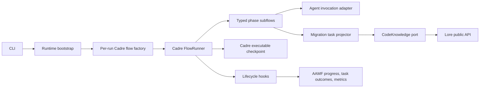

# AAMF Codebase Improvement Plan

Status: Proposed
Reviewed commit: `965d24e` on `main`
Review date: 2026-09-07

This document records verified design and code-quality improvements found during a full repository review. The target architecture has two explicit ownership boundaries:

- Cadre's flow DSL and runner own orchestration, dependency scheduling, retries, loops, parallelism, and executable checkpoint state.
- Lore owns codebase indexing, code-knowledge queries, and language-neutral graph analysis.

AAMF should own migration policy: configuration, source-to-target task projection, agent contracts, migration-specific quality gates, progress reporting, and product-level checkpoints. The plan below replaces the earlier review of `e7ca5f5`; those findings were revalidated against the current branch and are summarized separately.

## Executive Summary

The current branch is substantially healthier than the prior review target. Commit `965d24e` fixed the previously documented checkpoint, agent-context, accounting, timeout, and type-checking defects. The remaining work is architectural rather than a broad collection of isolated bugs.

Three different layers currently try to orchestrate agents:

1. Cadre owns the visible top-level flow and the nested Phase 4 flow.
2. AAMF step implementations also own retries, loops, fan-out, DAG scheduling, and phase cursors through `RetryExecutor`, `ParallelExecutor`, and custom checkpoint fields.
3. Generated agent prompts still tell some agents to launch other agents, despite the runtime already doing so.

Likewise, Lore correctly owns source and target indexing, but AAMF's 1,743-line task-graph builder reconstructs symbol edges, SCCs, connected components, clustering, and dependency summaries that Lore 0.4.0 exposes through public APIs.

The recommended direction is to make Cadre the only executable orchestration authority and Lore the only code-knowledge authority. AAMF remains responsible for migration policy and for projecting Lore facts into target-specific migration tasks.

## Implementation Status (2026-09-07)

Implementation proceeded in the required sequence through Stage 0 and the local portions of Stage 1. Work stopped at the first genuine external release blocker rather than consuming unpublished framework code or deleting the custom executors prematurely.

### Completed work

- Added a required no-network full-flow tier using the real runtime bootstrap, Lore indexing, Cadre flow, checkpoints, target indexing, and report generation with a scripted schema-valid agent invoker. The tier covers `per-task`, `wave-barrier`, and `sync-epoch`, required-agent rejection with Git/file/index rollback and resume, final-parity exhaustion, and convergence on the final allowed iteration.
- Made missing/malformed structured output, structured `failed`, structured `needs-review`, and missing required artifacts non-success outcomes at the launcher boundary.
- Added runtime-owned persisted target change sets, removed agent Git/checkpoint responsibility, deferred commits to validated task/wave/phase boundaries, and added real-file/Git rollback coverage including regressive minor parity passes.
- Made required source Lore startup, adjudication, enabled idiomatic review/planning/refactoring, and non-empty Phase 6 suite plans fatal instead of silently successful.
- Added the Phase 5 terminal convergence gate and checkpointed required-fix failure evidence.
- Temporarily rejected `reuseKb`, removed Phase 1's filename-only stale-task reuse, and cleared unvalidated executable artifacts on fresh runs.
- Serialized/coalesced target indexing with a long-lived builder, retryable failed construction, and exactly-once first-build callback behavior.
- Normalized source exclusion semantics once and passed effective globs into Lore indexing; the no-network fixture proves excluded files produce neither Lore rows nor migration tasks.
- Removed the two inactive meta-agents and peer-launch/Git/checkpoint instructions from active templates.
- Added root Cadre cancellation wiring, idempotent reverse-order resource cleanup, process-first shutdown, and disposable signal listeners.
- Consolidated agent context/result prompt schemas around Zod contracts, inferred agent/context/result types from those contracts, validated context before serialization, and generated JSON Schema from the same definitions.
- Removed legacy model configuration aliases, rejected mixed old/new model settings, aligned `maxBlockedTasks` default to `0`, and deeply froze normalized configuration.

### Cadre 0.3.0 release and consumption

Cadre framework `0.3.0` was implemented, reviewed, merged in [CADRE #464](https://github.com/jafreck/CADRE/pull/464), and published through npm trusted publishing with provenance. It provides propagated node signals, cooperative timeout settlement, quiescent parallel/map/concurrent failure, rich lifecycle events, dynamic typed subflow options, non-erasing child-context typing, serialized checkpoints, retry isolation, and explicit loop termination/exhaustion.

AAMF now consumes the released `@cadre-dev/framework@0.3.0` package. The integration:

- builds a fresh flow for every run;
- derives Phase 4 runner options per execution without mutable module state or unsafe casts;
- uses Cadre's required-convergence loop semantics;
- consumes rich lifecycle events for incremental phase progress, complete phase summaries, and Phase 4 metrics;
- propagates cancellation to active agent processes and proves no later Cadre nodes start;
- sources phase boundaries from an acyclic dependency-free registry.

Custom executors remain only where the corresponding phase has not yet been converted into named Cadre nodes.

### Lore 0.4.2 scoped SCIP integration update (2026-09-09)

- Phase 0 derives a host-owned `scipScope` from source languages and source file globs, intersects it with the Lore walker, and passes the same scope, walker, branch, and migration-grade policy during build and revalidation. Repository `.lore.config` files cannot grant scope or execution.
- LSP is explicitly disabled. Built-in subprocesses, build-system execution, custom commands, installation, and additional working-directory roots are independent operator permissions and default to denied.
- KB reuse uses a v2 identity covering Lore 0.4.2, source content and Git revision, walker/scope selection, validation facts, embeddings, execution policy, compilation database, and compiler/indexer executable content identities. Immutable inputs are checked across the build, generated identities are stabilized around validation, schema compatibility alone no longer permits reuse, and every candidate is revalidated.
- Rebuilds occur in a separate candidate database. AAMF promotes only a certified candidate, preserving the previous valid KB and failed-run diagnostics when indexing or required-fact validation fails.
- The zstd fixture regenerates a current-root CMake compdb with the macOS SDK and an extra `programs/lorem.c` variant that includes `programs/windres/verrsrc.h`. Scoped native verification covers every declared file, runs only scip-clang, records complete zero-error compiler diagnostics, and resolves the required `ZSTD_createCCtx` call via `scip_definition`.

Run the native acceptance check under Node 22 with `npm run test:zstd-scip`.

Earlier validation at this boundary used Node 22.22.1:

- `npm run ci:local`: passed; 55 files and 1,599 tests passed, 10 files and 211 tests skipped.
- Coverage: 89.87% statements, 77.09% branches, 92.51% functions, and 91.59% lines.
- The required no-network full-flow matrix passed all eight cases.
- No paid/live-agent test was run.

### Finding status after Cadre 0.3.0 integration

| Finding | Status | Remaining acceptance work |
|---------|--------|---------------------------|
| AAMF-015 | Partial | Represent `needs-review` as an explicit Cadre branch after the framework upgrade. |
| AAMF-016 | Complete | None. |
| AAMF-017 | Complete | None. |
| AAMF-018 | Partial | Implement Cadre-native blocked/dependant/threshold policy during Phase 4 conversion. |
| AAMF-019 | Complete | None. |
| AAMF-020 | In progress | Convert remaining imperative Phase 3-7 agent fan-out/recovery bodies into stable Cadre nodes before deleting custom executors. |
| AAMF-021 | In progress | Replace phase-specific cursor/snapshot fields with the generic Cadre snapshot store during phase conversion. |
| AAMF-022 | Partial | Lifecycle-based phase reporting and Phase 4 metrics are active; typed contracts/data routing remain for converted phase nodes. |
| AAMF-023 | Complete | Generated/reference documentation refresh remains tracked by AAMF-033. |
| AAMF-024 | Not started | Stage 3 Lore identity release work. |
| AAMF-025 | Not started | Stage 3 Lore graph API work. |
| AAMF-026 | Not started | Stage 3 projection split after Lore upgrade. |
| AAMF-027 | Partial | Complete the per-node policy registry during Cadre-native phase conversion. |
| AAMF-028 | Complete | None. |
| AAMF-029 | Partial | Remove obsolete persisted cursor/sidecar fields with AAMF-021/AAMF-031. |
| AAMF-030 | Not started | Stage 4, after ownership transitions. |
| AAMF-031 | Not started | Stage 4, after ownership transitions. |
| AAMF-032 | Partial | Add execution-ID crash cases for every converted Phase 3-7 child plus scheduled live-smoke ownership. |
| AAMF-033 | Not started | Stage 5 documentation regeneration. |
| AAMF-034 | Complete | None. |
| AAMF-035 | Partial | Full manifest/artifact provenance and safe KB reuse require Lore identity. |
| AAMF-036 | Complete | None. |
| AAMF-037 | Partial | Exclusion-driven identity invalidation requires AAMF-024. |
| AAMF-038 | Partial | Finish every converted phase's promotion node and wave transaction policy. |

## Validation Baseline

Validation used the repository's pinned Node.js version, Node 22.22.1.

- `npm run typecheck`: passed for production and test TypeScript projects.
- `npm test`: passed; 52 test files and 1,581 tests passed, while 10 files and 211 tests were skipped.
- `npm run ci:local`: passed with 87.53% statements, 73.93% branches, 90.65% functions, and 89.19% lines.
- `npx tsc --noEmit --noUnusedLocals --noUnusedParameters`: reported 28 existing unused-symbol diagnostics across 13 production files.
- Paid/live migration suites were not run. They remain gated by `AAMF_E2E=1`.
- The unrelated untracked `docs/competitive-analysis.md` must not be modified or removed while implementing this plan.

## Strengths To Preserve

- Strict TypeScript, Zod config validation, separate production/test type checks, and enforced coverage thresholds provide a strong safety baseline.
- Runtime paths, checkpoint writes, process handling, MCP request bounds, and observability are separated into focused infrastructure modules.
- The top-level pipeline already uses real Cadre primitives: `step`, `gate`, `conditional`, `loop`, `parallel`, and `subflow`.
- Source indexing, incremental target indexing, and agent-facing MCP queries already call Lore rather than implementing parsers or search engines in AAMF.
- The test suite has deep unit coverage around checkpoint recovery, task graph behavior, agent launching, and Phase 4 execution modes.

## Target Architecture



The ownership rules should be explicit:

- Cadre node IDs, dependencies, loops, branches, retries, and `completedExecutionIds` are the executable state.
- AAMF checkpoint data stores product facts such as task outcomes, costs, failure evidence, and artifact paths. It does not independently decide what executes next.
- Lore builds and queries code knowledge. AAMF consumes typed Lore results and never reads Lore tables directly.
- Agents perform one reasoning task and never launch peer agents. The Cadre flow launches every agent.

## Priority 0: Correctness And Lifecycle

### AAMF-015: Enforce one authoritative agent outcome contract

**Severity:** Critical

**Evidence**

- The shared prompt fragment says the final `aamf-json` block is mandatory and that a missing block marks the run failed in [`aamf-json-output-format.md`](../agents/templates/_partials/aamf-json-output-format.md#L1-L5).
- [`finaliseResult()`](../src/core/agent-launcher.ts#L554-L577) deliberately leaves an exit-0 invocation successful when the block is missing and never maps structured `status: "failed"` or `status: "needs-review"` into the runtime result.
- The current test explicitly preserves that contradiction in [`agent-launcher.test.ts`](../tests/core/agent-launcher.test.ts#L512-L551).
- Phases such as knowledge construction trust `AgentResult.success` and can therefore checkpoint an invocation with no valid structured result as complete in [`kb-construction.ts`](../src/flow/steps/kb-construction.ts#L24-L38).

**Recommended change**

Define a typed domain outcome at the launcher boundary. Process success is necessary but not sufficient: required structured output must parse, `completed` maps to success, `failed` maps to a typed execution failure, and `needs-review` maps to an explicit review/recovery branch in Cadre. Validate required artifacts separately from process exit status.

**Acceptance criteria**

- Every runtime-invoked agent has one documented structured-output policy; no prompt and parser disagree.
- Missing or malformed required output cannot complete a Cadre node.
- `status: "failed"` cannot produce `AgentResult.success === true`.
- `needs-review` is routed explicitly and is never silently treated as completed.
- Table-driven launcher tests cover the cross-product of exit code, parse result, structured status, and required artifact presence.

### AAMF-016: Wire cancellation through Cadre and make runtime resources scoped

**Severity:** High

**Evidence**

- [`MigrationRuntime.run()`](../src/core/runtime.ts#L331-L339) creates an `AbortController`, but omits its signal from `FlowRunnerOptions` even though Cadre supports `signal`.
- The shutdown handler later calls `abort()`, so the intended cancellation path is inert at the runner boundary in [`runtime.ts`](../src/core/runtime.ts#L632-L696).
- The handler comment says child processes are killed first, but it stops servers and disposes embeddings before calling `killAllActiveProcesses()`.
- Signal handlers are registered on every initialization and have no disposal path.

**Recommended change**

Pass `signal: abortController.signal` to the root runner so Cadre stops scheduling new nodes and propagates cancellation to child flows. Do not mistake that for active-operation cancellation: Cadre 0.2.5 does not expose the signal to running nodes, and its timeout wrapper does not stop underlying work. Retain launcher-owned process termination until Cadre provides a node signal and structured cancellation contract.

Extract a `RunLifecycle`/resource scope that owns the run lock, KB servers, target server, embedder, active child processes, signal handlers, and final flush. Cleanup should be idempotent, reverse acquisition order, and run around all post-lock startup work, not only the runner call.

**Acceptance criteria**

- Aborting the controller stops new Cadre nodes and returns a `cancelled` result after active work reaches quiescence.
- Running agent/command nodes receive cancellation through an explicit signal or launcher termination path.
- In-flight child processes are terminated before waiting on server teardown.
- Every acquired resource is released when startup, flow execution, report generation, or shutdown fails.
- Repeated runtime creation does not increase process signal-listener counts.
- Focused tests use fake resources to assert acquisition and cleanup order.

### AAMF-017: Make target indexing single-flight and lossless

**Severity:** High

**Evidence**

- [`TargetIndexer.updateForFiles()`](../src/core/target-indexer.ts#L43-L66) returns immediately when the first build is already in progress, dropping the second caller's file set.
- If the first build throws, `building` is never reset because the transition is not protected by `finally`.
- Existing tests cover only sequential successful calls in [`target-indexer.test.ts`](../tests/core/target-indexer.test.ts#L43-L112).

**Recommended change**

Replace `built`/`building` coordination with one serialized update queue, a shared in-flight build promise, and a coalesced pending-file set. All callers should await initial construction; changes that arrive during construction must be applied after it settles. Serialize later incremental updates as well: each call currently creates a new `IndexBuilder`, and Lore's mutex is instance-local. Prefer one long-lived builder owned by the wrapper. Inject a small Lore indexer factory so concurrency and failure behavior can be tested without timing a real index build.

**Acceptance criteria**

- Concurrent first and incremental updates never overlap, and each caller resolves only after its changes are represented.
- A failed first build leaves the indexer retryable.
- `onFirstBuild` runs exactly once after the first successful, fully settled build.
- Tests cover overlapping updates, build failure followed by retry, and callback failure.

### AAMF-018: Implement or remove blocked-task policy; do not expose inert configuration

**Severity:** High

**Evidence**

- `continueOnBlocked` and `maxBlockedTasks` are declared in [`schema.ts`](../src/config/schema.ts#L157-L168), but no production code reads either value.
- The schema comment and configuration guide say the default is unlimited (`0`), while the actual schema default is `1`.
- README and configuration docs claim the policy is enforced even though Phase 4 raises terminal exhaustion directly.

**Recommended change**

Preserve the documented capability, but express it in the Phase 4 Cadre flow. Domain failures should produce typed blocked outcomes; independent task nodes may continue when configured, dependent nodes should be marked upstream-blocked, and a final gate should enforce `continueOnBlocked` plus the threshold. Keep `0 = unlimited` and make it the actual default.

**Acceptance criteria**

- `continueOnBlocked: false` halts on the first blocked task.
- `continueOnBlocked: true` executes independent tasks but never executes blocked dependants.
- A positive `maxBlockedTasks` halts exactly at the configured threshold; `0` is unlimited.
- Config defaults, README, generated context, and behavior tests agree.

## Priority 1: Make Cadre The Orchestration Authority

### AAMF-019: Build a fresh Cadre flow for every run

**Severity:** High

**Evidence**

- The exported flow uses a module-level mutable `_phase4RunnerOpts` object because subflow options depend on runtime context in [`migration-flow.ts`](../src/flow/migration-flow.ts#L52-L64).
- The Phase 4 flow thunk mutates that shared object with `Object.assign()` immediately before Cadre reads it, then casts away a generic mismatch with `as unknown as FlowNode` in [`migration-flow.ts`](../src/flow/migration-flow.ts#L122-L133).
- There is an import cycle: `migration-flow` imports the Phase 4 builder, the builder imports `checkpoint-adapter`, and the adapter imports phase boundaries from `migration-flow`.

**Recommended change**

Replace the singleton `migrationFlow` construction path with `createMigrationFlow(runOptions)`. At runtime construction, checkpoint adapters, concurrency, hooks, contracts, and cancellation are already known; capture fresh values in the returned definition. The dynamic Phase 4 `flow` thunk can still build task nodes from Phase 1 output while its `runnerOptions` remain per-run and static, matching Cadre 0.2.5's runtime API.

Fix Cadre's subflow typing before expecting the cast to disappear: `FlowNode<TContext>` currently erases the child-context generic, so a per-run factory alone cannot make `FlowSubflowNode<TParent, TChild>` assignable without a cast.

Move phase descriptors and boundary IDs into a dependency-free module so the flow, checkpoint adapter, CLI filtering, and reporting derive from one registry without a cycle.

**Acceptance criteria**

- No module-level mutable flow or runner-option state remains.
- Two concurrent flow instances use distinct checkpoint adapters, concurrency, hooks, and signals.
- Cadre preserves the child-context generic in its node union, and AAMF needs no `as unknown as FlowNode` cast.
- The flow/checkpoint module graph is acyclic.
- Tests construct two flows with different options and prove complete isolation.

### AAMF-020: Express every agent launch, retry, loop, and fan-out in the Cadre DSL

**Severity:** High

**Evidence**

- Phase 3 is one Cadre step, but internally launches planner and adjudicator, conditionally scaffolds, and runs a build in [`planning.ts`](../src/flow/steps/planning.ts#L18-L112).
- Phase 4 uses Cadre nodes but still invokes custom `RetryExecutor` and `ParallelExecutor`, including a hidden parity/test fan-out and imperative recovery loops in [`migration.ts`](../src/flow/steps/migration.ts#L195-L445).
- The Phase 5 Cadre loop contains a step that imperatively iterates and launches every fix in [`final-parity.ts`](../src/flow/steps/final-parity.ts#L24-L119).
- Phase 6 and Phase 7 recreate retry, concurrency, wave, and DAG scheduling inside ordinary steps in [`finalization.ts`](../src/flow/steps/finalization.ts#L63-L219) and [`idiomatic-refactor.ts`](../src/flow/steps/idiomatic-refactor.ts#L102-L335).

**Recommended change**

Build each phase as a typed subflow:

- Phase 3: `sequence(planner, conditional(adjudicator), scaffold, optional build gate)`.
- Phase 4: stable task nodes and dependency edges; `parallel` for parity/test; `loop` plus `conditional`/`gate` for remediation and model escalation.
- Phase 5: checker node followed by a dynamic fix subflow, wrapped in the outer convergence loop.
- Phase 6: plan node, then a dynamic suite-writer subflow in parallel with documentation.
- Phase 7: conditional review subflow, planner node, then a dependency-wired refactor subflow.

Use stable generated nodes rather than an opaque `map` callback whenever each item needs independent checkpoint/resume. Keep `TaskQueue` only for pure graph planning helpers; remove its execution methods once Cadre owns scheduling. Retire `ParallelExecutor` and `RetryExecutor` only after Cadre supports the cancellation, quiescence, event, retry, and loop-exhaustion semantics in AAMF-036. Model escalation and recovery should remain visible as flow nodes rather than being hidden in a generic retry callback.

**Acceptance criteria**

- Every agent invocation appears as a named Cadre node with a stable execution ID.
- No flow step creates `ParallelExecutor`, `RetryExecutor`, or ad hoc `Promise.all()` agent scheduling.
- Retry/backoff, recovery, convergence, and terminal exhaustion are visible in the flow definition and checkpoint.
- Flow visualization accurately shows all agent work for Phases 3 through 7.
- Existing execution-mode behavior remains covered by golden flow-shape and behavior tests.

### AAMF-021: Keep one source of executable checkpoint truth

**Severity:** High

**Evidence**

- Cadre persists completed node IDs in `completedExecutionIds`, while AAMF separately persists `completedTasks`, per-task `completedSubsteps`, execution-ID maps, and scope prefixes in [`checkpoint.ts`](../src/core/checkpoint.ts#L16-L106).
- [`runTrackedPhase4TaskSubstep()`](../src/flow/steps/migration.ts#L111-L126) consults `completedTasks` before Cadre executes a node and writes a second completion record after it succeeds.
- Resume preparation contains custom logic to reconcile and filter Cadre IDs from AAMF task cursors in [`checkpoint.ts`](../src/core/checkpoint.ts#L640-L779).
- Phases 3, 5, 6, and 7 also maintain manual completion flags/cursors inside Cadre nodes.

**Recommended change**

Treat Cadre's checkpoint snapshots as the sole answer to "what should execute next?" A nested flow still needs its own Cadre snapshot; store snapshots generically by flow ID rather than in a Phase 4-specific checkpoint field. Remove manual substep skip checks, cursor-driven loops, and execution-ID reconciliation. Keep `completedTasks`, failures, durations, and artifact paths only as a derived run record updated by task-completion events; they must never gate node execution.

Because AAMF is pre-release, prefer a clean checkpoint version break with a clear incompatibility error over retaining permanent legacy reconciliation code.

**Acceptance criteria**

- Deleting derived AAMF task metadata does not cause a completed Cadre node to rerun.
- Altering derived metadata cannot cause an incomplete Cadre node to be skipped.
- Resume tests interrupt after every Phase 4 substep and every Phase 5-7 dynamic child node.
- Checkpoint reset/filtering operates on phase/node metadata, not execution-ID string parsing.
- Phase-specific cursors, the named `__phase4FlowCheckpoint` field, and compatibility filters are replaced by a generic versioned Cadre snapshot store.

### AAMF-022: Use Cadre contracts and lifecycle hooks instead of mutable side channels

**Severity:** High

**Evidence**

- No AAMF flow node currently declares Cadre `inputSchema`, `outputSchema`, routed `input`, or flow contracts.
- Phase 1 stores its output both as a node return value and in mutable `ctx.phase1TaskGraphResult`; later code falls back across context, files, and step output.
- The checkpoint adapter already derives `completedPhases` on every Cadre save, but [`MigrationRuntime.run()`](../src/core/runtime.ts#L336-L371) updates progress and returned phase results only after the full runner returns by casting every arbitrary execution output to `PhaseResult`. Nodes in Phases 4 through 7 do not expose that shape, and those updates are skipped when the runner throws.
- `phase4Snapshot` is created in the flow context, but `MetricsCollector.setPhase4Snapshot()` is never called and `phase4DurationMs` remains zero.

**Recommended change**

Add Zod input/output schemas to phase and agent nodes, route data with Cadre references or typed child-flow context maps, and remove duplicate mutable output caches. Extend Cadre's lifecycle event contract first: current hooks omit execution ID/path, attempt, duration, and node-failure events. Use the richer events for node/phase progress and metrics, while the checkpoint adapter continues deriving phase completion from boundary metadata. Emit one typed run summary from flow outputs.

**Acceptance criteria**

- Invalid node output fails at the producing node boundary.
- Phase 4 consumes the typed Phase 1 output without `phase1TaskGraphResult` or file fallback during one run.
- Progress and checkpoint phase state update before a later node fails.
- Final results contain one entry for every executed phase from 0 through 8.
- Phase 4 mode, duration, task count, wave count, and command counters are nonzero when corresponding work occurred.

### AAMF-023: Remove agent-authored orchestration and unused meta-agents

**Severity:** High

**Evidence**

- `migration-runner` and `migration-orchestrator` have no registered phase and are never launched by the runtime, but templates and generated definitions describe a second complete scheduler.
- The active [`code-migrator` template](../agents/templates/code-migrator.md#L103-L114) instructs a worker to launch parity, test, and recovery agents even though the runtime already launches them.
- The active `e2e-test-crafter` template similarly tells the agent to delegate suite writers, while Phase 6 performs that fan-out itself.
- Mutating agent templates include a Git commit requirement, bypassing runtime `gitLimiter`, per-agent/per-task commit policy, and wave-level deferred commits.
- README and `.github/agents/README.md` still present a hierarchical agent scheduler rather than Cadre-owned orchestration.

**Recommended change**

Delete the two unused meta-agent roles, templates, schemas, context cases, and generated files. Make every active prompt explicitly single-purpose: agents may inspect Lore and perform their assigned work, but must not invoke peer agents, mutate orchestration/checkpoint state, or commit Git state. The E2E crafter should emit only a validated suite plan; Cadre launches suite writers. The runtime is the sole owner of Git transaction boundaries.

**Acceptance criteria**

- Every registered agent is launched by at least one Cadre node, and every Cadre-launched agent is registered.
- No active prompt instructs an agent to launch another AAMF agent.
- Worker agents do not write the runtime checkpoint, schedule work, or run `git add`/`git commit`.
- Agent count, catalog, generated definitions, README, and tests agree.

## Priority 1: Make Lore The Code-Knowledge Authority

### AAMF-024: Move index freshness into Lore's public contract

**Severity:** High

**Evidence**

- [`computeSourceFingerprintCompat()`](../src/flow/steps/kb-indexing.ts#L70-L84) probes an API that Lore 0.4.0 does not export, then falls back to hashing only root path, globs, and embedding model. Source contents are absent.
- Reuse reads `source_fingerprint` from Lore metadata, but the installed `IndexBuilder` does not persist that key; AAMF writes its value only to checkpoint state in [`kb-indexing.ts`](../src/flow/steps/kb-indexing.ts#L106-L133) and [`kb-indexing.ts`](../src/flow/steps/kb-indexing.ts#L210-L221).
- With `reuseKb`, checkpoint loading preserves the completed `kb-index` execution ID before any fingerprint check, so Cadre can skip Phase 0 entirely in [`checkpoint.ts`](../src/core/checkpoint.ts#L164-L201).
- Tests mock several historical Lore API shapes instead of exercising the installed public contract in [`kb-indexing.test.ts`](../tests/flow/steps/kb-indexing.test.ts#L220-L318).

**Impact**

The cache identity has no single owner. Normal runs rebuild unnecessarily because the expected DB key is absent; `reuseKb` can bypass freshness validation entirely; and a database carrying that key from another implementation can be considered fresh even after source files change.

**Recommended change**

Add one freshness/identity API to Lore that includes source state and all index-affecting options, and have `IndexBuilder` persist it transactionally after a successful build. AAMF should call that public API and store the returned opaque identity for reporting only. Remove version probing and local fallback hashing.

**Acceptance criteria**

- An unchanged source tree and options reuse the index.
- Changing file contents, includes/excludes, branch/revision, SCIP/LSP settings, or embedding settings invalidates the relevant index state.
- Failed or cancelled builds never publish a fresh identity.
- Git and non-Git source trees have deterministic, tested behavior.
- AAMF contains no Lore API-shape probes or `any`-typed compatibility calls.

### AAMF-025: Consume Lore graph analysis instead of rebuilding it in AAMF

**Severity:** High

**Evidence**

- [`task-graph-builder.ts`](../src/core/task-graph-builder.ts#L70-L151) loads Lore rows and builds its own dependency summary, SCCs, and connected components.
- The same file contains a second symbol clustering engine, custom unresolved-name matching, Tarjan SCC implementation, union-find implementation, and raw `SELECT ... FROM type_refs` access in [`task-graph-builder.ts`](../src/core/task-graph-builder.ts#L576-L737) and [`task-graph-builder.ts`](../src/core/task-graph-builder.ts#L1500-L1635).
- Lore 0.4.0 publicly exports `listTypeRefs`, `detectSymbolCycles`, `findConnectedComponents`, `clusterSymbols`, and `buildCodebaseSummary` in addition to `listFiles`, `listSymbols`, and `listResolvedEdges`.

**Recommended change**

Introduce a narrow `CodeKnowledge` port implemented by `LoreKnowledgeProvider`. The adapter opens Lore read-only and returns an immutable snapshot of files, symbols, typed relationships, cycles, connected components, and summary data using only public Lore APIs. Upgrade Lore where necessary so these APIs query its effective layered views and expose the representative symbols/file metrics AAMF needs.

Lore 0.4.0's clustering is not a drop-in replacement for AAMF's task builder: it does not split oversized SCCs and does not expose all current summary fields. Generic relationship resolution and SCC/CC analysis belong in Lore. Migration-specific bounded partitioning, oversized-SCC scaffolding, and stub policy may remain in AAMF's projector until a richer canonical Lore clustering API exists. Do not maintain duplicate generic graph analysis in both projects.

**Acceptance criteria**

- No AAMF source reads `symbol_refs`, `type_refs`, `file_imports`, or other Lore tables directly.
- No symbol-level relationship resolution, SCC, or connected-component algorithm remains in AAMF; any retained partitioning is explicitly migration-specific.
- A contract test runs the installed Lore adapter against a fixture database and validates the snapshot.
- Golden fixtures compare task inputs before/after the transition and make intentional clustering changes explicit.
- AAMF uses Lore-exported database types and removes unnecessary direct `better-sqlite3`, `@types/better-sqlite3`, `sqlite-vec`, and `fast-glob` dependencies.

### AAMF-026: Split Lore facts from migration-specific task projection

**Severity:** Medium

**Evidence**

- The 1,743-line [`task-graph-builder.ts`](../src/core/task-graph-builder.ts) currently combines database access, graph construction, cluster mutation, oversized-SCC splitting, micro-task elision, source-to-target path mapping, task prose, compilation-unit assignment, and validation.
- Task and cluster IDs are based on array position and mutable counters, making identity dependent on traversal/order details.
- The broad unit suite mirrors this implementation in a 1,051-line test file, which makes behavioral changes expensive to localize.

**Recommended change**

Separate the pipeline into small pure stages:

1. `LoreKnowledgeProvider` returns canonical code facts.
2. `MigrationClusterPolicy` applies only migration-specific constraints that do not belong in Lore, such as target-language stub strategy or maximum agent scope.
3. `MigrationTaskProjector` maps clusters to target paths, task metadata, acceptance criteria, and dependencies.
4. `CompilationUnitAssigner` annotates and validates build-unit ownership.

Use stable IDs derived from source identity plus stable symbol/file identities rather than list position. Keep target-language mapping and migration scaffold decisions in AAMF; keep codebase facts and generic graph algorithms in Lore.

**Acceptance criteria**

- Pure projector tests use in-memory `CodeKnowledge` fixtures and do not open SQLite.
- Lore adapter tests do not know about target languages or agent prompts.
- Reordering equivalent Lore results does not change task IDs or dependency output.
- Every task is bounded, every dependency references a task, every source scope appears exactly once or in an explicitly documented shared/stub scope, and output is deterministic.
- Files are split by responsibility; no replacement module becomes another graph/planning god object.

## Priority 2: Contracts, Structure, And Verification

### AAMF-027: Make failure criticality explicit and never checkpoint failed required work

**Severity:** High

**Evidence**

- Source KB server startup catches every error and returns without a server in [`kb-server-lifecycle.ts`](../src/flow/steps/kb-server-lifecycle.ts#L11-L37), allowing downstream agents to run without the required Lore access.
- Phase 3 records adjudicator tokens but never checks whether the adjudicator succeeded in [`planning.ts`](../src/flow/steps/planning.ts#L45-L58).
- Enabled Phase 7 review failures are skipped, and failed refactor tasks are added to `completedTaskIds` in [`idiomatic-refactor.ts`](../src/flow/steps/idiomatic-refactor.ts#L145-L164) and [`idiomatic-refactor.ts`](../src/flow/steps/idiomatic-refactor.ts#L304-L329).
- The flow documentation says every enabled phase is critical, but implementation policy varies through local `catch`/warning blocks.

**Recommended change**

Define failure policy once for every Cadre node or phase: `fatal`, `blocked-domain-outcome`, or `advisory`. Required source Lore access and required agent decisions must fail their node. Optional means a phase may be disabled; it does not mean an enabled phase silently succeeds after failed work. Target-index enrichment or scaffold verification may remain advisory only if the product contract says so.

**Acceptance criteria**

- A source KB server startup failure stops the first KB-dependent node.
- A requested adjudication failure fails planning.
- Enabled idiomatic review/refactor failures cannot be recorded as completed.
- Every caught error is either rethrown as a typed failure or recorded through an explicit advisory policy.
- Failure-policy tests enumerate every flow node category.

### AAMF-028: Generate agent prompt schemas and TypeScript types from one Zod contract

**Severity:** High

**Evidence**

- The actual serialized context is `AgentContext` with `agent`, `projectName`, `config`, `inputFiles`, `outputPath`, and `payload` in [`types.ts`](../src/agents/types.ts#L196-L230).
- Generated prompt input schemas instead require `contextFile`, `projectRoot`, and `progressDir`, which are invocation-envelope fields not present in that JSON file, in [`registry.ts`](../src/agents/registry.ts#L14-L47).
- Prompt output JSON schemas require `outputFiles`, while runtime Zod schemas based on `AamfOutputBase` neither declare nor require it in [`agent-output-schemas.ts`](../src/agents/agent-output-schemas.ts#L9-L28).
- Generator tests prove that generated schemas equal the hand-written registry objects, but not that either matches what `ContextBuilder` writes or `AgentLauncher` parses.

**Recommended change**

Define a context Zod schema and result Zod schema for each agent in the registry. Infer TypeScript types from those schemas, validate contexts before writing, validate outputs after parsing, and generate prompt JSON Schema with Zod 4's JSON-schema conversion. Keep front matter/tool metadata alongside the contracts, but remove parallel hand-authored schema representations.

**Acceptance criteria**

- One schema definition drives TypeScript inference, context validation, output validation, and generated prompt JSON Schema.
- A table-driven test builds a real context for every registered agent and validates it against that agent's schema.
- Generated schema examples round-trip through the runtime parser.
- Required/optional fields cannot differ between prompts and runtime.
- Agent-specific payloads use typed discriminated contracts rather than `Record<string, unknown>`.

### AAMF-029: Remove compatibility aliases and normalize configuration once

**Severity:** Medium

**Evidence**

- Canonical `models.*` settings coexist with deprecated `agentBackend.model`, `agentBackend.failureRecoveryModel`, and `options.modelRouting` in [`schema.ts`](../src/config/schema.ts#L23-L70) and [`schema.ts`](../src/config/schema.ts#L265-L288).
- Compatibility discrimination and field mapping are duplicated in [`shared.ts`](../src/flow/steps/shared.ts#L141-L175) and [`migration.ts`](../src/flow/steps/migration.ts#L51-L65).
- AAMF is pre-release and explicitly has no backward-compatibility requirement, yet checkpoint, sidecar, config, token-parser, and Lore compatibility paths continue to accumulate.

**Recommended change**

Accept one current config shape and expose one fully normalized `MigrationConfig` to all runtime code. Remove model aliases instead of branching at each use site. For persisted state, either migrate exactly one known prior version at load or reject incompatible versions with a clear reset message; do not retain indefinite field-by-field compatibility behavior.

**Acceptance criteria**

- Runtime code reads only `models.default`, `models.failureRecovery`, and `models.routing`.
- Mixed old/new model configuration is rejected rather than resolved by undocumented precedence.
- Schema defaults and field constraints match documentation and tests.
- Deprecated sidecar and unused checkpoint/config fields are removed.
- Config loading returns an immutable normalized value or its documentation no longer claims deep freezing.

### AAMF-030: Decompose large modules around stable ownership boundaries

**Severity:** Medium

**Evidence**

- The largest production modules are `task-graph-builder.ts` (1,743 lines), `migration.ts` (1,570), `shared.ts` (1,014), `checkpoint.ts` (855), `agent-launcher.ts` (729), and `runtime.ts` (700).
- `MigrationRuntime` owns config, validation, generated files, locks, signal handling, service construction, flow execution, cleanup, reports, status, reset, and console formatting.
- `MigrationFlowContext` is a broad service locator plus mutable state bag, and [`runtime.test.ts`](../tests/core/runtime.test.ts) uses 33 `as any` casts to reach private state.

**Recommended change**

Perform decomposition after Cadre and Lore ownership is corrected, so the new modules follow real boundaries rather than preserving accidental ones:

- `RuntimeBootstrap`: config, paths, generated-agent validation, dependency construction.
- `RunLifecycle`: lock, cancellation, resources, shutdown, and disposal.
- `MigrationApplication`: thin facade for run/status/reset.
- Phase-specific Cadre flow factories with pure node builders.
- `AgentInvoker`, `CommandRunner`, `GitWorkspace`, and `CodeKnowledge` ports for infrastructure.

Keep cohesive helpers local and avoid one-class-per-function abstraction. Split `shared.ts` by domain only when call sites have moved to the new flow modules.

**Acceptance criteria**

- Runtime tests inject typed dependencies through public constructors/factories and do not mutate private fields.
- Flow node functions depend on the narrowest service interface they need.
- No replacement module combines orchestration, persistence, and infrastructure concerns.
- Core behavior remains testable without a real CLI, network, Git repository, or SQLite database.

### AAMF-031: Delete dead paths and enable unused-code checks

**Severity:** Medium

**Evidence**

- A strict unused-symbol diagnostic reports 28 production diagnostics, concentrated in `flow/context.ts` and `flow/steps/shared.ts`.
- Verified dead paths include `hasCompetingStrategies()`, `hasPhase4Substep()`, `runWaveEndQualityGates()`, deprecated sidecar parsing, unused `completedPhase2Groups`, and the two meta-agent contracts.
- `noUnusedLocals` and `noUnusedParameters` are disabled in [`tsconfig.json`](../tsconfig.json#L14-L20).

**Recommended change**

Remove dead behavior as each owning redesign lands, then enable both compiler checks. Prune direct dependencies after import ownership is clear; currently `fast-glob` and `sqlite-vec` have no AAMF imports, and direct SQLite types can come through Lore's public API.

**Acceptance criteria**

- Production and test projects pass with `noUnusedLocals` and `noUnusedParameters` enabled.
- No deprecated function remains solely to satisfy obsolete tests.
- `npm ls --depth=0` contains only direct runtime requirements.
- Dead-code removal is behavior-neutral or paired with an explicit product-contract change.

### AAMF-032: Add a deterministic, no-network full-flow test tier

**Severity:** High

**Evidence**

- The normal suite is broad and fast, but most flow tests invoke individual step functions with hand-built `FlowExecutionContext` objects rather than running the assembled production flow.
- Ten test files and 211 tests are skipped by default; live migration suites require agent CLIs and potentially paid model calls.
- CI explicitly does not enable `AAMF_E2E`, so no required check exercises the complete runtime/flow/checkpoint integration.

**Recommended change**

Add a scripted `AgentInvoker` test double that returns schema-valid outputs and writes deterministic artifacts. Run the real runtime bootstrap, real Cadre flow, checkpoint adapter, Lore fixture index, and report path against temporary source/target trees. Inject failures at named Cadre execution IDs to test restart behavior without model calls.

Keep live migrations opt-in, but give them a documented scheduled/manual owner with spend limits and preflight validation.

**Acceptance criteria**

- CI runs a no-network full flow through all enabled phases.
- Matrix cases cover per-task, wave-barrier, and sync-epoch execution.
- Crash/resume cases fail after representative nodes in Phases 3 through 7 and prove exactly-once continuation.
- Cancellation, blocked-task policy, required-agent failure, Lore unavailability, and report generation are covered end to end.
- An optional scheduled live smoke run has an explicit budget, timeout, concurrency cap, and artifact retention policy.

### AAMF-033: Regenerate documentation from current contracts and architecture

**Severity:** Medium

**Evidence**

- README claims 16 agents, references an absent impact assessor and Phase 3 task-decomposer path, describes deprecated sidecars, and says blocked-task policy is enforced.
- [`configuration.md`](configuration.md) still instructs users to `cd runtime`, lists stale defaults, describes only two of three execution modes in places, and shows deleted modules such as `orchestrator.ts` and `phase-registry.ts`.
- [`.github/agents/README.md`](../.github/agents/README.md) documents an obsolete hierarchical agent scheduler, old paths, removed roles, and old artifact layout.
- The README TypeScript badge says 5.9 while the project uses TypeScript 7.

**Recommended change**

Update documentation only after the Cadre, Lore, config, and agent-contract changes settle. Generate field/default reference material from the Zod config schema and agent catalog from the registry. Keep architecture prose focused on ownership and observable behavior; remove historical implementation claims that tests do not enforce.

**Acceptance criteria**

- README, configuration guide, generated agent docs, CLI help, schema defaults, and runtime behavior agree.
- Cadre owns every depicted launch/retry/branch; Lore owns every depicted code-knowledge operation.
- No removed file, role, option, sidecar, or artifact path appears in active documentation.
- A docs-sync test checks commands, phase/agent catalogs, defaults, and referenced repository paths.

## Additional Priority 0 Findings

### AAMF-034: Final parity can exhaust without convergence and still complete

**Severity:** Critical

**Evidence**

- [`runFinalParityIteration()`](../src/flow/steps/final-parity.ts#L76-L119) ignores failed code-migrator fixes, advances the iteration cursor, and still returns the original nonzero fix count.
- Cadre 0.2.5's `loop` returns normally when `maxIterations` is reached even if `until` never becomes true.
- The top-level flow has no post-loop convergence gate and proceeds directly to Phase 6 in [`migration-flow.ts`](../src/flow/migration-flow.ts#L145-L160).

**Impact**

A migration can be reported successful and proceed to E2E/documentation with known unresolved whole-codebase parity defects.

**Recommended change**

Fail an iteration when any required fix fails. Return a typed convergence result containing detected, applied, failed, and remaining fixes. Add a required post-loop gate that passes only after a fresh final-parity check reports zero blocking fixes. Extend Cadre's loop result under AAMF-036 so exhaustion is explicit rather than inferred.

**Acceptance criteria**

- Any failed required fix fails the iteration and is checkpointed with evidence.
- Reaching the maximum iteration count with remaining fixes fails Phase 5.
- Phase 6 cannot begin until a fresh final-parity result has no blocking fixes.
- Tests cover fix failure, repeated non-convergence, convergence on the final allowed iteration, and clean first-pass completion.

### AAMF-035: Bind checkpoints and artifacts to input provenance

**Severity:** Critical

**Evidence**

- A fresh run resets checkpoint state but leaves prior artifacts in place.
- Phase 1 unconditionally loads an existing `tasks-merged.json` before consulting the newly built Lore index in [`task-graph.ts`](../src/flow/steps/task-graph.ts#L29-L61).
- `reuseKb` preserves early completed execution IDs without first validating source identity in [`checkpoint.ts`](../src/core/checkpoint.ts#L164-L201).
- Cadre snapshots and phase artifacts carry no flow-definition version, normalized input identity, producer version, or dependency identities.

**Impact**

A fresh or resumed run can execute a stale task graph, plan, or completed-node snapshot against different source code, configuration, Lore semantics, or flow structure.

**Recommended change**

Create a versioned run manifest and artifact envelope. At minimum record flow-definition version, checkpoint schema version, Lore index identity, relevant normalized config hash, producer version, and upstream artifact identities. Validate provenance before loading an artifact or Cadre snapshot and invalidate from the earliest mismatched phase through all dependants.

Until Lore provides the authoritative identity in AAMF-024, reject `reuseKb` and ensure a fresh run ignores/removes stale executable artifacts. Prefer content-addressed phase directories or manifest-validated artifacts over filename existence checks.

**Acceptance criteria**

- A fresh run cannot load a prior `tasks-merged.json` unless reuse was explicitly requested and provenance matches.
- Source, indexing options, task policy, target language/framework, or flow-version changes invalidate the correct transitive phases.
- Corrupt, partial, or mismatched artifact sets fail closed with a clear recovery instruction.
- Resume with identical inputs preserves exactly the intended completed Cadre nodes.
- Tests cover each provenance dimension and the earliest invalidated phase.

### AAMF-036: Close Cadre framework gaps before deleting AAMF schedulers

**Severity:** High

**Evidence**

- `FlowExecutionContext` has no `AbortSignal`, so running node work cannot observe cancellation.
- Cadre node timeout rejects a wrapper promise but does not cancel the underlying node operation.
- `parallel` uses fail-fast `Promise.all`; after one branch rejects, siblings continue running and may write files/checkpoints after the parent flow reports failure.
- Current lifecycle hooks omit execution ID/path, attempt, duration, and node-failure events.
- The subflow node union erases its child-context generic, and `runnerOptions` cannot be derived from parent context.
- A loop does not report whether it ended by convergence, maximum iterations, or cancellation.

**Recommended change**

Release a Cadre version with the minimum semantics AAMF needs:

1. Node execution contexts receive a propagated abort signal.
2. Timeouts abort underlying work and await settlement.
3. Parallel/map scopes cancel siblings on fatal failure and await all branches before returning or checkpointing the scope.
4. Lifecycle events include execution identity, path, attempt, timing, completion, skip, failure, and cancellation.
5. Subflow typing preserves child context and supports a safe per-execution options factory if needed.
6. Loop results expose a typed termination reason and optionally require convergence.

Use these Cadre APIs in AAMF instead of rebuilding equivalent machinery locally.

**Acceptance criteria**

- Cadre's own tests prove cancellation, timeout settlement, quiescent parallel failure, nested propagation, event ordering, typed subflows, and loop exhaustion.
- AAMF upgrades to the released version before removing `ParallelExecutor`, `RetryExecutor`, or manual convergence guards.
- A failing parallel branch cannot leave a sibling mutating target files after its Cadre scope returns.
- AAMF contains no local reimplementation of the new framework semantics.

### AAMF-037: Apply configured source exclusions to Lore indexing

**Severity:** High

**Evidence**

- `source.excludePatterns` is a public, documented configuration field in [`schema.ts`](../src/config/schema.ts#L15-L24).
- Phase 0 constructs Lore's walker config with only `{ rootDir }` in [`kb-indexing.ts`](../src/flow/steps/kb-indexing.ts#L106-L114).
- Lore's public `WalkerConfig` supports `excludeGlobs`, but no production AAMF code forwards the configured patterns.

**Impact**

User-excluded generated, vendored, test, secret-bearing, or irrelevant paths can enter the knowledge base and task graph, increasing cost and producing incorrect migration scope.

**Recommended change**

Define whether configuration values are globs or directory names, normalize once, and pass them to every source Lore build/update/freshness operation as `excludeGlobs`. Include normalized exclusions in the Lore index identity and expose the effective indexing scope in diagnostics.

**Acceptance criteria**

- Excluded fixture files produce no Lore file, symbol, summary, or migration task records.
- Nested directory names and explicit glob patterns have documented behavior.
- Changing exclusions invalidates the source index and downstream artifacts.
- Config, CLI indexing behavior, tests, and documentation use the same semantics.

### AAMF-038: Make target mutations transactional and runtime-owned

**Severity:** Critical

**Evidence**

- Active mutating prompts tell agents to stage and commit directly in [`git-commit-requirement.md`](../agents/templates/_partials/git-commit-requirement.md#L1-L7), while the runtime also owns per-agent, per-task, and per-wave commit policy.
- Agent-owned commits bypass `gitLimiter` and `deferGitCommits`, so parallel wave agents can commit concurrently despite the intended barrier.
- The minor parity repass commits changes before re-verification in [`migration.ts`](../src/flow/steps/migration.ts#L405-L445).
- When re-verification introduces non-minor issues, the code logs "reverting" but restores only the in-memory parity result; target files and Git history remain changed.

**Impact**

A failed or regressive agent attempt can become durable and then be falsely represented as the previously accepted result. Concurrent agent commits can also corrupt the intended wave transaction boundary.

**Recommended change**

Make the runtime the sole Git owner. Execute every mutating agent into an isolated or scoped `TargetChangeSet` (temporary worktree, patch, or captured file snapshot), run required validation against that candidate, then promote and commit it at the Cadre task/wave boundary. On failure, discard or restore the actual files, index state, and Git state. Agents must never commit directly.

**Acceptance criteria**

- No generated prompt grants Git commit responsibility to an agent.
- Failed/rejected attempts leave target files, target Lore index, and Git HEAD unchanged.
- A regressive minor repass is actually rolled back and cannot restore stale parity metadata over changed code.
- Parallel non-overlapping candidates promote deterministically at the wave barrier with serialized Git operations.
- Integration tests compare file contents and Git history before and after success, rejection, crash, and resume.

## Prior Review Revalidation

Commit `965d24e` addressed the defects from the review of `e7ca5f5`. They should not be reopened as separate repairs unless a regression test fails.

| Prior ID | Current status | Follow-up in this plan |
|----------|----------------|------------------------|
| AAMF-001 Phase 4 completion checkpoint | Fixed | Remove the resulting duplicate execution authority under AAMF-021. |
| AAMF-002 read-only status | Fixed | Preserve `CheckpointManager.peek()`. |
| AAMF-003 reset semantics | Fixed | Simplify after Cadre becomes the only executable checkpoint. |
| AAMF-004 idiomatic task payload | Fixed | Replace the imperative Phase 7 scheduler under AAMF-020. |
| AAMF-005 phase mislabeling | Fixed | Preserve typed phase registration. |
| AAMF-006 Copilot model override | Fixed | Simplify aliases under AAMF-029. |
| AAMF-007 measured token precedence | Fixed | Preserve source-attributed token accounting. |
| AAMF-008 multi-file agent scope | Fixed | Preserve full-array context contract under AAMF-028. |
| AAMF-009 KB timeout overlap | Fixed | Preserve settle-before-retry behavior; add cancellation when Lore exposes it. |
| AAMF-010 dangling dependency false cycle | Fixed | Preserve precise graph validation. |
| AAMF-011 MCP request/lifecycle bounds | Fixed | Preserve the bounded transport wrapper. |
| AAMF-012 stale E2E paths | Path bug fixed | Add required no-network flow coverage and explicit live-suite ownership under AAMF-032. |
| AAMF-013 inert `keepArtifacts` | Fixed by removal | Keep destructive cleanup out of the default contract. |
| AAMF-014 tests excluded from typecheck | Fixed | Preserve both CI type-check jobs. |

## Implementation Sequence

### Stage 0: Characterization And Immediate Correctness

1. Build the scripted full-flow harness from AAMF-032 far enough to characterize current phase transitions, mutation boundaries, and resume behavior.
2. Fix the false-success and stale-input paths in AAMF-015, AAMF-027, AAMF-034, AAMF-035, and AAMF-038.
3. Fix target-index serialization and source exclusions under AAMF-017 and AAMF-037.
4. Remove peer-launch and Git-commit instructions from active prompts under AAMF-023.
5. Reject `reuseKb` temporarily until AAMF-024 has a released Lore identity API.
6. Wire root cancellation and correct cleanup order from AAMF-016, while retaining launcher process termination until Cadre supports active-node cancellation.
7. Do not begin broad module movement until these behavior tests pass.

### Stage 1: Contracts And Framework Prerequisites

1. Consolidate agent context/result contracts under AAMF-028 and normalize configuration under AAMF-029.
2. Implement and release the Cadre capabilities in AAMF-036.
3. Upgrade AAMF to that Cadre release and complete active-node cancellation from AAMF-016.
4. Implement the per-run flow factory and dependency-free phase registry from AAMF-019.
5. Wire typed node contracts, richer lifecycle events, phase reporting, and generic per-flow snapshots from AAMF-021 and AAMF-022.
6. Keep current phase bodies temporarily, but establish the new checkpoint and reporting boundary before converting them.

### Stage 2: Cadre-Native Phase Conversion

Convert one phase at a time and run crash/resume tests after each conversion:

1. Phase 3 planning/adjudication/scaffold.
2. Phase 5 final-parity/fix loop and terminal convergence gate.
3. Phase 6 E2E planning, suite fan-out, and documentation.
4. Phase 7 review/planning/refactor DAG.
5. Phase 4 task modes, recovery, and blocked-task policy.

After each phase, remove only the cursor/executor code made obsolete by that conversion. Implement AAMF-018 as part of the Phase 4 flow, not as another imperative scheduler. Finish AAMF-020 and AAMF-021 only after all three Phase 4 modes pass interruption tests.

### Stage 3: Lore Boundary And Task Projection

1. Add the required index-identity, effective graph-analysis, and summary capabilities to Lore and release a compatible version.
2. Implement `LoreKnowledgeProvider` against that public version.
3. Complete provenance validation and safely restore `reuseKb` under AAMF-024 and AAMF-035.
4. Characterize current task graphs on representative fixtures, then replace generic graph internals with Lore under AAMF-025.
5. Split and simplify migration projection under AAMF-026 without changing target-task policy accidentally.

### Stage 4: Structural Cleanup

1. Decompose runtime modules under AAMF-030 along the boundaries established in Stages 1 through 3.
2. Remove dead paths/dependencies and enable unused-code checks under AAMF-031.

### Stage 5: Product Verification And Documentation

1. Run the full no-network flow matrix and all standard validation.
2. Establish the optional budget-bounded live smoke owner.
3. Regenerate README/configuration/agent documentation under AAMF-033.

## Definition Of Done

- `src/flow/**` contains no custom agent scheduler, retry executor, or executable phase cursor.
- Every agent launch and recovery decision is represented by a Cadre node with a stable execution ID.
- Cadre scopes cancel and settle active work before returning; their checkpoints alone determine resume execution.
- AAMF state is derived reporting/domain data, and every executable artifact is provenance-validated.
- AAMF performs no raw Lore SQL and implements no language-neutral relationship, SCC, or connected-component algorithm.
- Migration-specific task partitioning is isolated from Lore code-knowledge acquisition.
- Every agent context and result has one Zod source of truth shared by prompts and runtime.
- Required failures cannot be logged and then checkpointed as success.
- Target changes are validated before promotion; agents never own Git commits.
- Configured source exclusions are reflected in Lore and task outputs.
- Production and tests pass type checking with unused-code checks enabled.
- The standard suite and scripted full-flow matrix pass on Node 22 with no network or model spend.
- Active documentation reflects only files, roles, options, paths, and behavior that exist.

## Agent Handoff Prompt

```text
Work in the AAMF repository on the current main branch. Read claude.md and docs/codebase-improvement-plan.md in full. Implement the current findings AAMF-015 through AAMF-038 in the documented stages; AAMF-001 through AAMF-014 are historical and already fixed.

The architecture constraints are mandatory:
- Cadre's flow DSL and FlowRunner are the only agent-orchestration and executable-checkpoint authority.
- Lore is the only code-indexing, code-knowledge, and language-neutral graph-analysis authority.
- AAMF owns migration-specific policy and projects typed Lore facts into target migration tasks.
- Agents perform one assigned task and never launch peer agents or commit Git state.

Start each stage from the controlling code path and make the smallest testable change. After the first edit, run the narrowest behavior test. Build the no-network full-flow harness before orchestration changes. Fix/release the required Cadre semantics before deleting AAMF executors, and make required Lore API changes in Lore before replacing knowledge/graph code. Preserve behavior with characterization tests before replacing Phase 4 or task-projection internals. Use stable Cadre node IDs and test crash/resume after each converted phase.

AAMF is pre-release. Prefer clean internal API and checkpoint breaks with clear errors over compatibility shims. Do not modify, delete, stage, or overwrite the pre-existing untracked docs/competitive-analysis.md. Do not run paid/live-agent tests unless explicitly authorized. Do not commit or create a branch unless explicitly requested.

At each stage, report completed finding IDs, focused tests, full validation results, and any acceptance criterion still open.
```